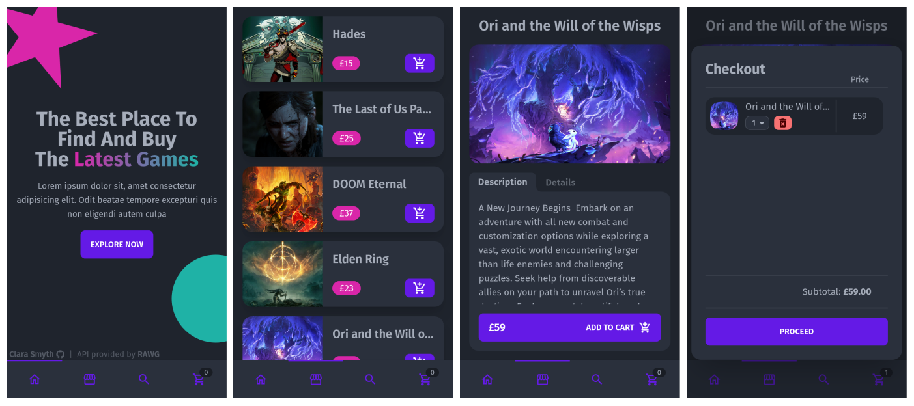

	<h1>Shopping Cart
	 
		
		
		
		 
	</h1>
	<h3><b><a href="https://clarasmyth.github.io/shopping-cart">View Live Demo</a></b></h3>

## Description

This is a webpage with a shopping cart created as part of [TheOdinProject](https://www.theodinproject.com) curriculum.

To see the assignment details - [Click Here](https://www.theodinproject.com/lessons/node-path-javascript-shopping-cart)

## Built Using

- React 
- TypeScript 
- Tailwindcss 
- ESLint 
- Prettier 

## Credits

#### Libraries

#### Images

#### Icons

- [React Icons](https://github.com/react-icons/react-icons)
- [Simple Icons](https://simpleicons.org/)

## Gallery

#### Desktop

#### Mobile

